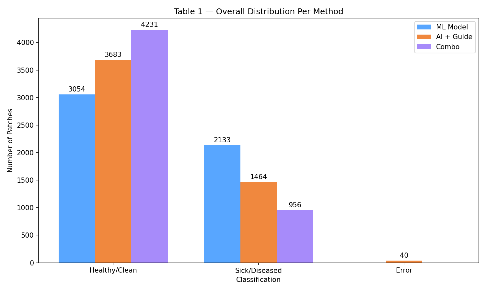
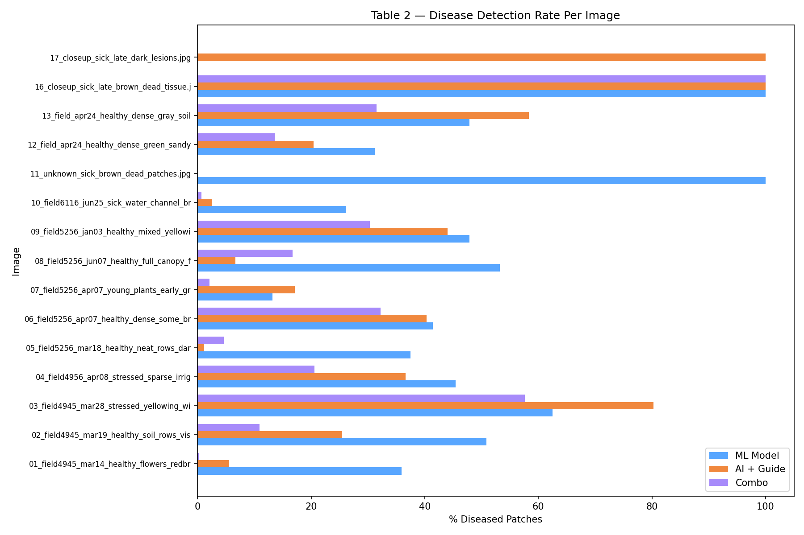
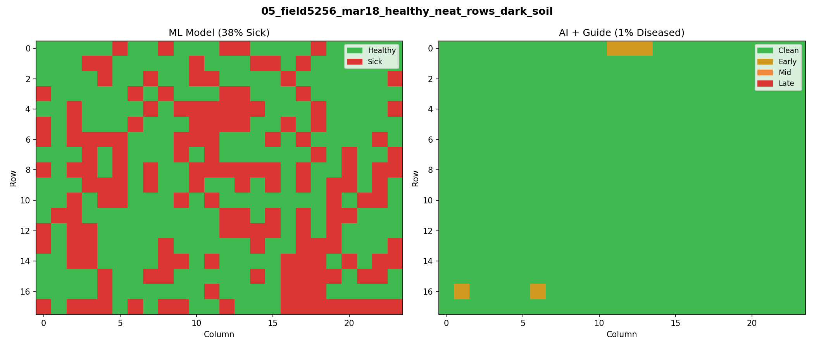
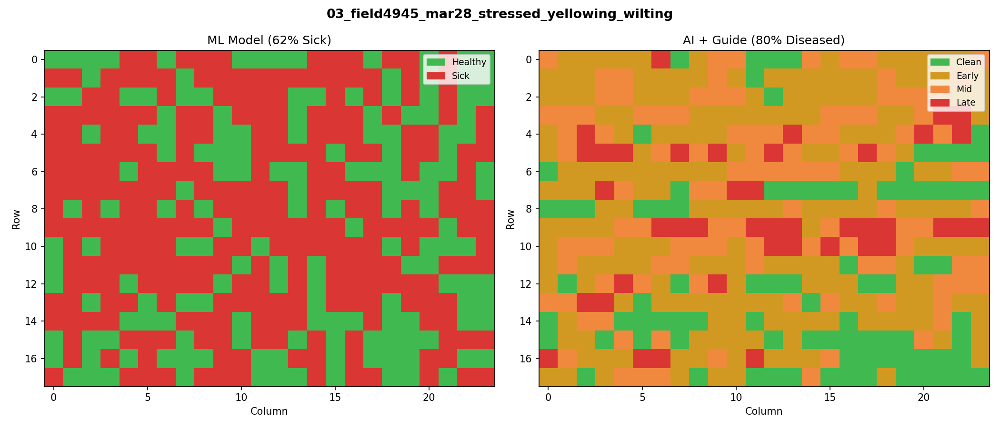
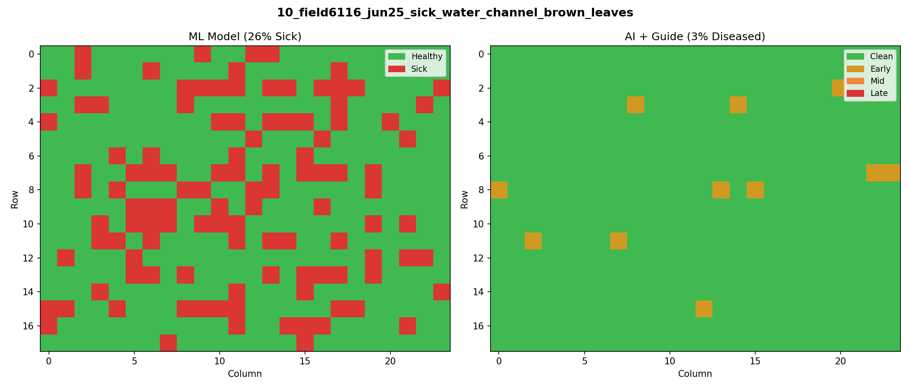
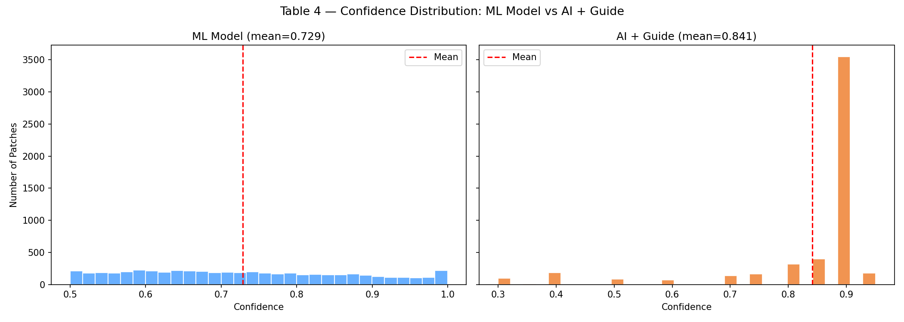
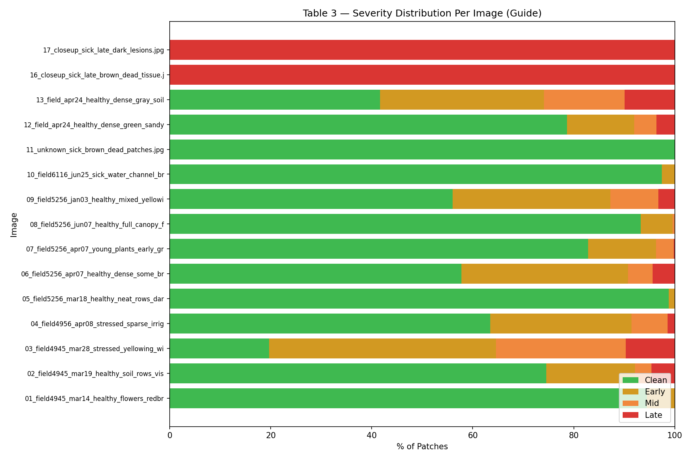
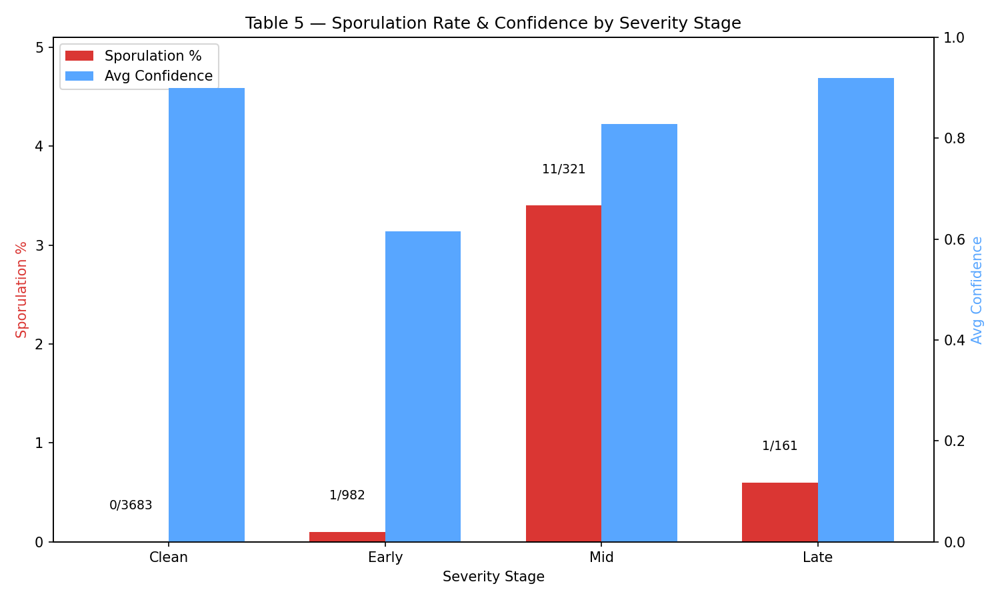

# Image Analysis — Findings Summary (Round 1)  

> **Dataset**: 5,187 patches from 15 drone images (224x224 pixels each)
> **Methods**: ML Model (MobileNetV2) | AI + Guide (Gemini 2.5 Flash) | Combo (ML filter + Guide)
> **Date**: March 2026

---

## Finding 1: The ML Model Over-Detects Disease

The ML model classified **2,133 patches (41.1%)** as Sick, while the AI + Guide classified only **1,464 patches (28.2%)** as diseased. The Combo method — which first filters through ML then sends "Sick" patches to the Guide — found only **956 patches (18.4%)** truly diseased.

| Method | Healthy/Clean | Sick/Diseased | Error |
|--------|:---:|:---:|:---:|
| ML Model | 3,054 (58.9%) | 2,133 (41.1%) | 0 |
| AI + Guide | 3,683 (71.0%) | 1,464 (28.2%) | 40 (0.8%) |
| Combo | 4,231 (81.6%) | 956 (18.4%) | 0 |

**Key insight**: Of the 2,133 patches ML called "Sick", the Guide reclassified **1,177 (55.2%)** as Clean. This means **ML has high recall but low precision** — it catches disease but also cries wolf on more than half its detections.

---

## Finding 2: Methods Disagree Strongly on Specific Images

The per-image analysis reveals dramatic disagreements:

| Image | ML % Sick | Guide % Diseased | Gap |
|-------|:---------:|:----------------:|:---:|
| 03_stressed_yellowing_wilting | 62.5% | 80.3% | Guide sees MORE |
| 08_healthy_full_canopy | 53.2% | 6.7% | ML sees 8x MORE |
| 10_sick_water_channel | 26.2% | 2.5% | ML sees 10x MORE |
| 05_healthy_neat_rows | 37.5% | 1.2% | ML sees 31x MORE |
| 01_healthy_flowers | 35.9% | 5.6% | ML sees 6x MORE |

**Key insight**: The ML model struggles with non-disease visual patterns. On image 05 (healthy with dark soil), ML flags 37.5% as sick — but the Guide sees only 1.2%. The ML model is confusing dark soil and shadows with disease.

---

## Finding 3: Disease Heatmaps Reveal Spatial Patterns

The side-by-side heatmaps show fundamentally different detection behaviors.

**Image 05 (healthy field)** — ML paints 38% of the grid red, scattered randomly. The Guide shows almost entirely green with only 3 patches flagged. ML is triggering on visual noise.

**Image 03 (stressed/wilting)** — Both methods agree this image has heavy disease. ML shows 62% red. The Guide shows a gradient: mostly Early (yellow) with Mid (orange) clusters and Late (red) patches. The Guide gives richer spatial information — you can see WHERE the disease is worst.

**Image 10 (sick with water channel)** — ML flags 26% as sick, scattered across the image. The Guide only flags 3% — just 11 Early patches, all clustered in specific locations.

**Key insight**: The ML model produces scattered, noisy predictions. The Guide produces cleaner, more spatially coherent predictions that align better with how disease actually spreads (in clusters, not randomly).

---

## Finding 4: Confidence Patterns Are Fundamentally Different

| Metric | ML Model | AI + Guide |
|--------|:--------:|:----------:|
| Mean | 0.729 | 0.841 |
| Median | 0.716 | 0.900 |
| Std Dev | 0.141 | 0.139 |
| Min | 0.500 | 0.300 |
| Max | 1.000 | 0.950 |
| % Above 0.8 | 32.4% | 79.5% |
| % Above 0.9 | 14.8% | 3.4% |

- **ML Model**: Flat distribution from 0.5 to 1.0. Many predictions hover around 0.5-0.7 — the model is often unsure. Only 32.4% above 0.8.
- **AI + Guide**: Massive spike at 0.9. Gemini clusters 79.5% above 0.8. This is **confidence clustering** — a known LLM behavior where the model defaults to high round numbers.

**Key insight**: ML's confidence is more spread out but often low — it's uncertain about many predictions. The Guide's confidence is inflated and clustered — it looks confident but the scores don't help distinguish easy from hard cases.

---

## Finding 5: Severity Classification Reveals Disease Structure

The Guide provides 4-class severity (Clean/Early/Mid/Late) that the ML model cannot:

| Severity | Patches | % of Total | Avg Confidence |
|----------|:-------:|:----------:|:--------------:|
| Clean | 3,683 | 71.0% | 0.899 |
| Early | 982 | 18.9% | 0.615 |
| Mid | 321 | 6.2% | 0.828 |
| Late | 161 | 3.1% | 0.919 |

The most diseased image is **03_stressed_yellowing_wilting**: only 20% Clean, with 45% Early, 26% Mid, and 10% Late.

**Key insight**: Early stage has the LOWEST confidence (0.615), while Clean (0.899) and Late (0.919) have the highest. This makes biological sense: early disease is subtle and hard to see, while clean and severe patches are visually obvious.

---

## Finding 6: Sporulation Is Rare and Concentrated in Mid Stage

| Severity | Total | Sporulation Yes | % |
|----------|:-----:|:---------------:|:---:|
| Clean | 3,683 | 0 | 0.0% |
| Early | 982 | 1 | 0.1% |
| Mid | 321 | 11 | 3.4% |
| Late | 161 | 1 | 0.6% |

**Key insight**: Only 13 patches out of 5,187 (0.25%) show sporulation. It peaks at Mid stage (3.4%), which aligns with biology — sporulation is most visible when disease is actively spreading. Numbers are too small for strong conclusions — we need more data in Round 2.

---

## Summary of Key Findings

| # | Finding | Evidence |
|---|---------|----------|
| 1 | ML over-detects: 41% sick vs Guide's 28% | Table 1, Combo filter (55% false alarms) |
| 2 | Methods disagree most on healthy images | Table 2 (ML sees 31x more on image 05) |
| 3 | ML predictions are noisy, Guide is spatially coherent | Heatmaps (15 images) |
| 4 | Guide has confidence clustering at 0.9 (LLM artifact) | Table 4 histograms |
| 5 | Early stage has lowest confidence (0.615) — hardest to classify | Table 3 severity data |
| 6 | Sporulation peaks at Mid stage (3.4%) — biologically consistent | Table 5 |

---

## Conclusion: Round 1 — What Worked, What Didn't, What's Next

### The Work Succeeded

Round 1 is a success. We built a working pipeline that takes drone images, slices them into patches, and runs them through 3 different detection methods. The Streamlit app works. The data collection works. We processed **5,187 patches across 15 images** and got real, analyzable results. The statistical analysis produced clear, measurable findings. The infrastructure is solid and ready for Round 2.

The most valuable outcome is the **Combo method** — it proved that combining ML + Guide catches false alarms that either method alone would miss. Of ML's 2,133 "Sick" detections, the Guide filtered out 1,177 false alarms (55%). This filtering approach has real practical value.

### The Biggest Problem: Training Data Was Not Good Enough

This is the most important lesson from Round 1. The original dataset from the research database contained **only sick patches** — images of potato fields with late blight disease. There were **no real healthy images** in the dataset. To build a binary classifier (sick vs healthy), we generated healthy patches from the same dataset using a Python script that tried to extract patches without visible disease.

This caused several problems:
- **Generated healthy patches were not reliable**: The Python script that created "healthy" patches sometimes picked patches that were not truly healthy — it was an automated guess, not expert labeling. Some of the generated healthy patches may have contained early disease or ambiguous areas.
- **No diversity in healthy samples**: All healthy patches came from the same images, same fields, same conditions. The model never saw real healthy potato plants from different fields, different growth stages, or different lighting conditions.
- **No intermediate cases**: The training data was either clearly sick or generated-as-healthy — nothing in between. Real fields have stressed plants, dry patches, shadows, flowers, and soil that look confusing but are not disease.

This explains why the ML model over-detects: it was trained on generated healthy patches that were not always correct and lacked diversity. When tested on real drone images with soil, shadows, and normal browning, the model had never seen these patterns and classified them as sick.

### The ML Model Was Weak

The MobileNetV2 model had serious problems in Round 1:

- **Too many false positives**: It flagged 41% of all patches as sick, but the Guide confirmed only about half of those. On healthy images like image 05, ML saw 37.5% disease where the Guide saw only 1.2%.
- **Confused by visual noise**: The heatmaps show ML triggering on dark soil, shadows, and non-disease browning. Its predictions are scattered randomly, not in disease clusters.
- **Low confidence across the board**: Mean confidence was only 0.729, with a flat distribution. The model is often guessing near 50-50.
- **Why**: The model was trained on only 1,000 images with basic binary labels (sick/healthy), and the healthy images were generated by a script that was not always correct and had no diversity. It never learned to distinguish disease from normal field variation.

### The Guide Was Messy

The AI + Guide approach also had issues:

- **Confidence clustering at 0.9**: Gemini defaults to high confidence values regardless of difficulty. 79.5% of predictions are above 0.8. This makes confidence scores unreliable for distinguishing easy from hard cases.
- **40 Error patches**: API failures that returned no classification — 0.8% of data is missing.
- **Sporulation detection too rare**: Only 13 out of 5,187 patches had sporulation "Yes" (0.25%). Either sporulation is genuinely rare in our dataset, or the Guide under-detects it.
- **Why**: The Guide relies on Gemini 2.5 Flash processing each patch image with a text prompt. The LLM is good at reasoning but not calibrated for confidence scoring, and its visual understanding of 224x224 drone patches has limits.

### What We Will Improve in Round 2

| Problem | Solution for Round 2 |
|---------|---------------------|
| **Training data had only sick images** | **Get real diverse data: healthy + sick from the same fields, same cameras** |
| **Healthy patches were generated by script (unreliable)** | **Use real labeled healthy images, not auto-generated ones** |
| **No data diversity** | **Collect images from different fields, dates, varieties, and conditions** |
| ML too many false positives | Train a new YOLO model with better annotations from Roboflow |
| ML confused by soil/shadows | Use object detection (bounding boxes) instead of whole-patch classification |
| ML only binary (sick/healthy) | YOLO can detect specific disease patterns, not just binary |
| Guide confidence clustering | Rewrite the prompt with calibrated confidence rubric + diverse examples |
| Guide too few sporulation | Add sporulation-specific examples to the detection guide |
| No ground truth labels | Manual labeling of ~200 patches + use Round 1 consensus labels |

### Bottom Line

Round 1 proved the concept works — the app, the pipeline, and the 3-method comparison all produce real statistical data with clear findings. But the **data quality was the main weakness**. The ML model was trained on sick-only data with manually collected healthy images from a different source, which led to high false positive rates. The Guide had confidence calibration issues. Round 2 will fix both by getting real diverse data from the research database and training a stronger model (YOLO) with proper annotations. The comparison between Round 1 and Round 2 will be the core of the research article — showing how better data and better tools improve detection accuracy.
