# Method Comparison — Findings Summary (Round 1)   

> **Dataset**: 5,147 patches from 15 drone images (after removing 40 Guide errors)
> **Methods**: ML Model (MobileNetV2) | AI + Guide (Gemini 2.5 Flash) | Combo (ML filter → Guide)
> **Ground Truth**: Majority vote (2/3 methods agree) — biased, see limitations
> **Date**: March 2026

---

## Statistical Methods Used

We used three key statistical tools to compare methods. Understanding these is essential for reading the results:

### Cohen's Kappa — "How much do they agree?"
Measures agreement between two methods, beyond random chance. Scale: 0 = random, 1 = perfect. Interpretation: <0.20 Poor | 0.20-0.40 Fair | 0.40-0.60 Moderate | 0.60-0.80 Substantial | >0.80 Almost Perfect. Treats all disagreements equally.

### QWK (Quadratic Weighted Kappa) — "How much do they agree, considering how far off?"
Same idea as Kappa but penalizes bigger mistakes more. Only works with ordinal categories (Early < Mid < Late). If Guide says Early and Combo says Late, that's a bigger penalty than Early vs Mid. ML can't have QWK because it only outputs Sick/Healthy.

### McNemar's Test — "When they disagree, is one consistently better?"
Kappa tells you how similar methods are. McNemar tells you who is BETTER when they differ. It only looks at patches where methods disagree and counts who is right more often. Gives a p-value: p < 0.05 means the difference is real (statistically significant), not luck.

---

## Approach 1 — Inter-Method Agreement (Method vs Method)

Before trying to measure accuracy (which needs ground truth), we first asked: **how much do the three methods agree with each other?** We compared all 3 pairs directly.

### ML vs Guide — Poor Agreement (Kappa = 0.118)

| Metric | Value |
|--------|-------|
| Total patches | 5,147 |
| Agreement rate | 59.2% |
| Cohen's Kappa | 0.118 (Poor) |
| ML says Sick | 2,123 (41.2%) |
| Guide says Sick | 1,464 (28.4%) |
| Both say Healthy | 2,304 (44.8%) |
| Both say Sick | 744 (14.5%) |
| ML Sick, Guide Healthy | 1,379 (26.8%) |
| ML Healthy, Guide Sick | 720 (14.0%) |

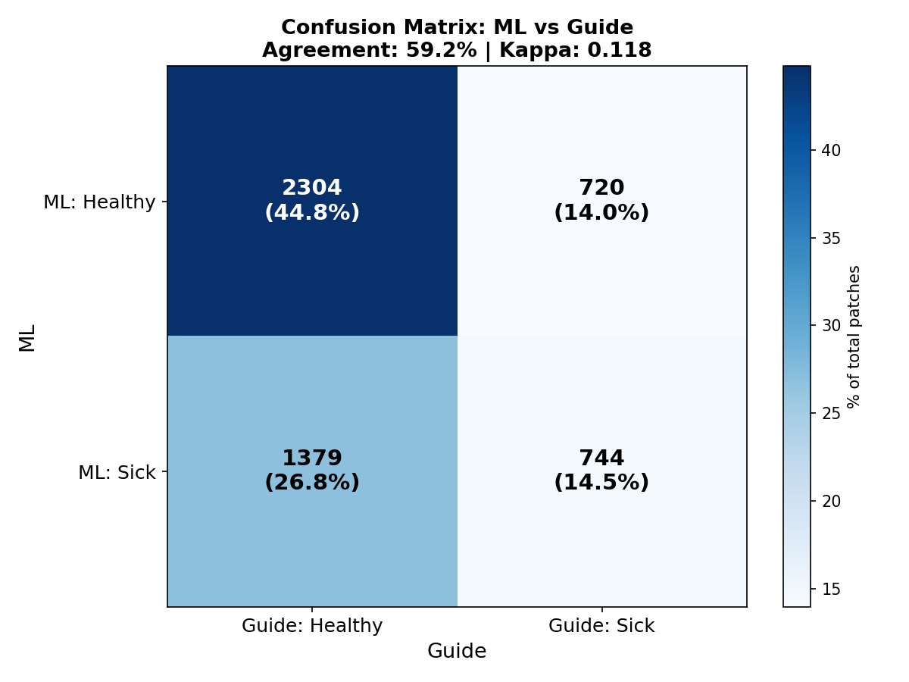
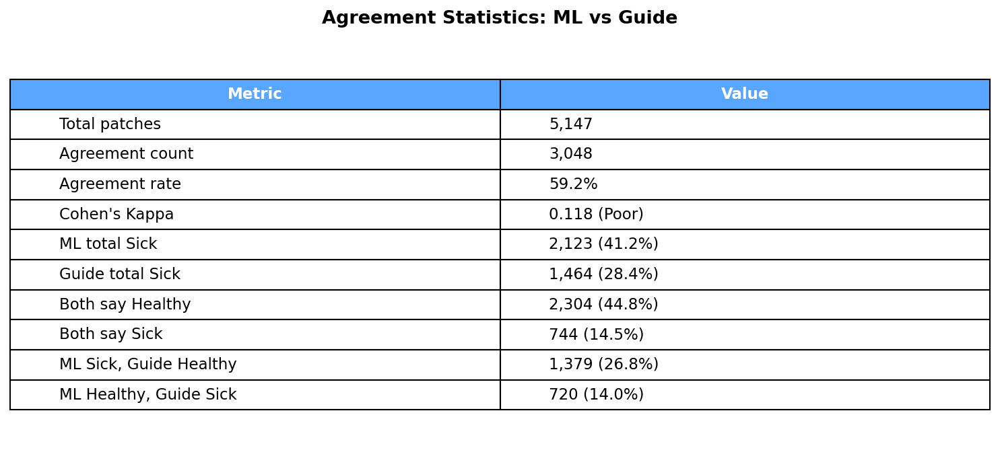

**Key insight**: ML and Guide have POOR agreement (Kappa = 0.118). They disagree on 40.8% of patches. ML flags 41% as sick — Guide only flags 28%. The 1,379 patches where ML says Sick but Guide says Healthy (26.8%) are likely ML false alarms. But the 720 patches where Guide says Sick but ML says Healthy (14%) are patches ML completely missed. They see disease very differently.

### ML vs Combo — Moderate Agreement (Kappa = 0.490)

| Metric | Value |
|--------|-------|
| Agreement rate | 77.3% |
| Cohen's Kappa | 0.490 (Moderate) |
| Both say Healthy | 3,024 (58.8%) |
| Both say Sick | 956 (18.6%) |
| ML Sick, Combo Healthy | 1,167 (22.7%) |
| ML Healthy, Combo Sick | 0 (0.0%) |

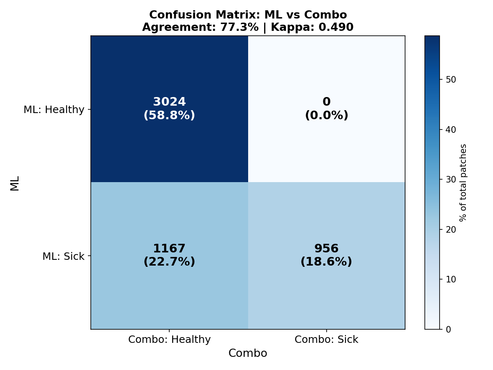
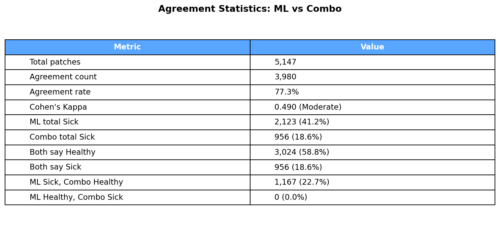

**Key insight**: ML and Combo agree 77.3% of the time. But notice: **ML Healthy, Combo Sick = 0 (0.0%)**. This is because Combo STARTS with ML — if ML says Healthy, the patch never reaches the Guide, so Combo automatically says Healthy too. This is the structural connection between ML and Combo. The 1,167 disagreements (22.7%) happen when ML says Sick but the Guide in Combo reclassifies as Healthy. These are ML's false alarms that the Guide caught.

### Guide vs Combo — Fair Agreement (Kappa = 0.280)

| Metric | Value |
|--------|-------|
| Agreement rate | 73.8% |
| Cohen's Kappa | 0.280 (Fair) |
| Both say Healthy | 3,262 (63.4%) |
| Both say Sick | 535 (10.4%) |
| Guide Sick, Combo Healthy | 929 (18.0%) |
| Guide Healthy, Combo Sick | 421 (8.2%) |

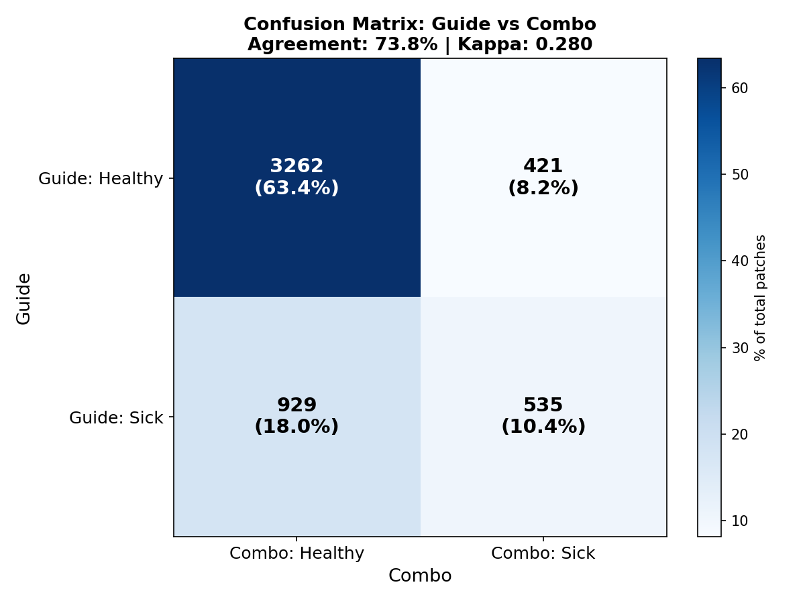
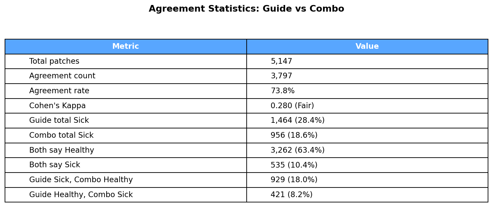

**Key insight**: Guide and Combo agree 73.8% but have Fair Kappa (0.280) — they both lean toward Healthy, inflating agreement. The 421 patches where Guide says Healthy but Combo says Sick (8.2%) are interesting: Combo uses the SAME Guide model, but Gemini gave a different answer on a second run. This is the first hint of LLM non-determinism.

### What Approach 1 Tells Us

1. **ML is the aggressive detector**: It flags 41% as sick — more than any other method. High recall, low precision.
2. **Guide is the conservative detector**: Flags only 28%. More selective but may miss things.
3. **Combo is the most conservative**: Only 18.6% sick. ML filters first, then Guide reviews — double filtering.
4. **ML and Combo are structurally connected**: When ML says Healthy, Combo always agrees (0% disagreement). This will bias any majority vote.
5. **The Guide runs independently**: No structural connection to ML or Combo. It makes its own decisions.

---

## Approach 2 — Majority Vote as Ground Truth

### Why Majority Vote?

We don't have expert labels. So we used **majority vote** (2 out of 3 methods agree) as a proxy ground truth. If ML and Guide both say Sick, majority = Sick. If only ML says Sick but Guide and Combo say Healthy, majority = Healthy.

### Consensus Breakdown

We first checked: how often do ALL three methods agree?

- **All 3 agree**: 2,839 patches (55.2%) — this is strong consensus
- **2 agree, 1 disagrees**: 2,308 patches (44.8%) — need majority vote here

If we required full agreement to have ground truth, we'd lose 44.8% of our data. That's too much. Majority vote lets us use ALL patches.

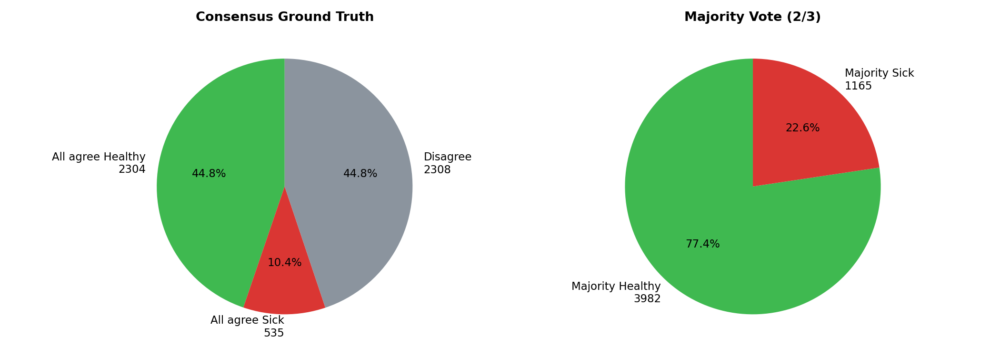

### Metrics vs Majority Vote

| Method | Accuracy | Precision | Recall | F1 | Kappa |
|--------|----------|-----------|--------|-----|-------|
| ML Model | 0.814 | 0.549 | 1.000 | 0.709 | 0.588 |
| AI + Guide | 0.778 | 0.508 | 0.639 | 0.566 | 0.420 |
| Combo | 0.959 | 1.000 | 0.821 | 0.901 | 0.876 |

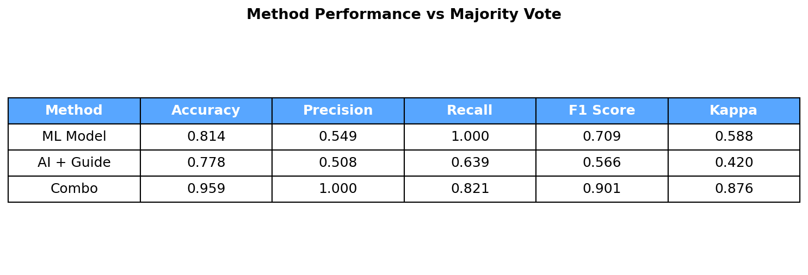
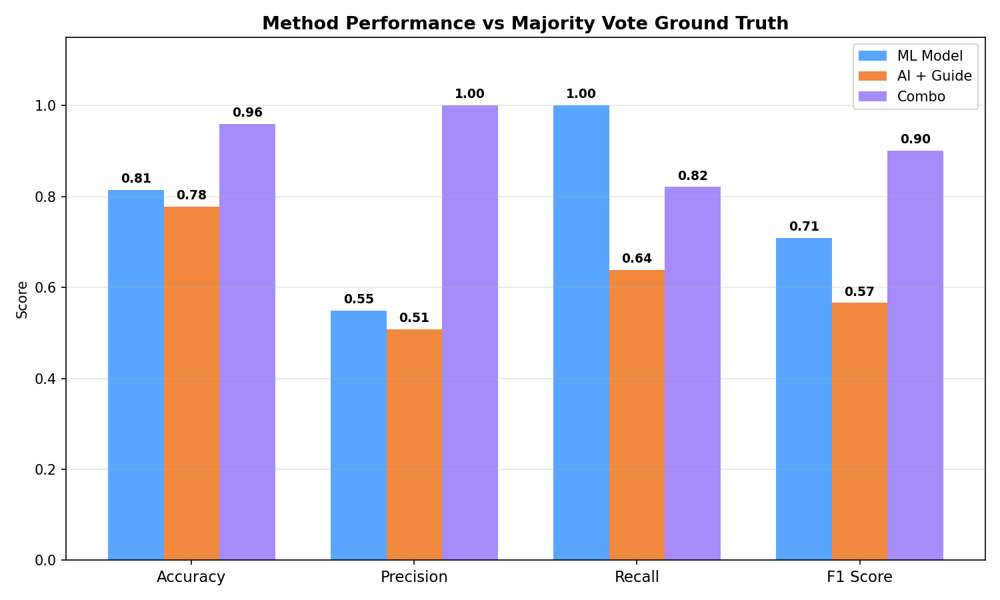

**Combo dominates**: 95.9% accuracy, perfect precision (1.000), and highest Kappa (0.876 = Almost Perfect). It's the best method by every metric.

**ML has perfect recall (1.000)**: It never misses a sick patch — because it flags everything. But precision is only 0.549, meaning 45% of its "Sick" calls are wrong.

**Guide has the lowest scores**: But this is where the bias matters (see below).

### Additional Metrics

**QWK (Guide vs Combo)**: 0.304 (Fair). This measures ordinal severity agreement — when both say a patch is sick, do they agree on Early/Mid/Late? Fair agreement means they often classify different severity levels, even when they agree on sick vs healthy.

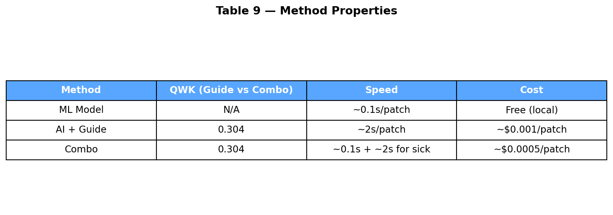

---

## Disagreement Analysis — Who Is Wrong and How?

### Disagreement Categories (Table 10)

| Category | Count | Percentage |
|----------|-------|------------|
| All Agree with Majority | 2,839 | 55.2% |
| Only ML Wrong | 958 | 18.6% |
| Only Guide Wrong | 1,141 | 22.2% |
| Only Combo Wrong | 209 | 4.1% |
| Multiple Wrong | 0 | 0.0% |

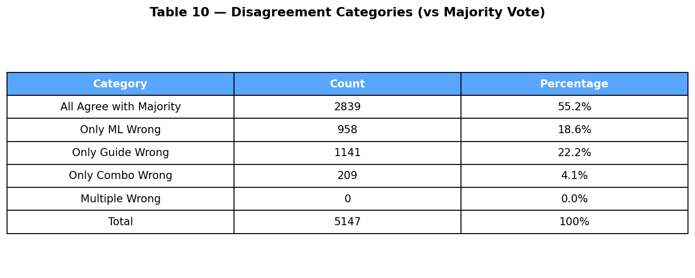

**Guide is the most frequent outlier** (22.2%), ML is second (18.6%), Combo barely disagrees (4.1%). Multiple Wrong = 0% because majority vote = 2/3, so only one method can be the outlier.

### Error Patterns (Table 11) — False Positives vs False Negatives

| Method | False Pos | False Neg | Total Errors |
|--------|-----------|-----------|-------------|
| ML Model | 958 | 0 | 958 |
| AI + Guide | 720 | 421 | 1,141 |
| Combo | 0 | 209 | 209 |

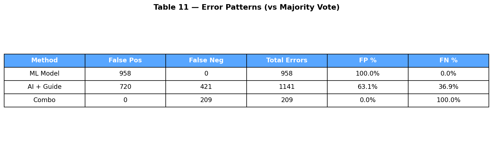

Each method has a completely different error profile:
- **ML**: Only false positives (958). Never misses disease but cries wolf on 958 patches. Like a fire alarm that goes off every time you cook.
- **Guide**: Both types (720 FP + 421 FN). Unreliable in both directions — sometimes says sick when healthy, sometimes says healthy when sick.
- **Combo**: Only false negatives (209). Never false alarms, but misses 209 sick patches. The safest method but can miss disease.

### McNemar's Test — Statistical Significance

| Pair | A right, B wrong | A wrong, B right | Chi2 | p-value | Better Method |
|------|-----------------|-----------------|------|---------|--------------|
| ML vs Guide | 1,141 | 958 | 15.78 | 0.0001 | ML |
| ML vs Combo | 209 | 958 | 479.44 | ≈0 | Combo |
| Guide vs Combo | 209 | 1,141 | 642.05 | ≈0 | Combo |

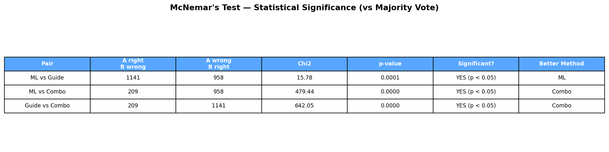

All differences are statistically significant (p ≈ 0). Combo is significantly better than both ML and Guide. ML is slightly better than Guide, but the gap is small (Chi2 = 15.78 vs 479 and 642 for the other pairs).

**Important**: "ML better than Guide" is partly an artifact of the majority vote bias (see next section).

---

## CRITICAL LIMITATION: Majority Vote Bias

**All Approach 2 results are biased. Here's why:**

ML and Combo share the same first step (ML filter). This creates a structural correlation:

**ML-Combo Correlation Breakdown:**
- ML said Healthy: ~3,014 patches → Combo automatically Healthy → they ALWAYS agree here
- ML said Sick: ~2,133 patches → sent to Guide in Combo
  - ~956: Guide-in-Combo says Sick → Combo = Sick → ML + Combo agree
  - ~1,177: Guide-in-Combo says Clean → Combo = Healthy → ML + Combo disagree
- **Total automatic agreement: ~3,970 (77%)**

The bias: on 3,970 patches, ML has a guaranteed voting partner. Guide never does. When ML says Sick, Combo often agrees, giving them 2 votes vs Guide's 1. Guide becomes the outlier even when Guide might be correct.

**What we should NOT say**: "ML is more accurate than Guide."

**What we SHOULD say**: "Against majority vote, ML shows higher agreement — but majority vote is biased because ML and Combo are correlated. True accuracy requires expert labels in Round 2."

---

## KEY FINDING: LLM Non-Determinism (630 contradictions = 12.2%)

This is perhaps the most important finding of the entire comparison.

Gemini (the AI behind the Guide) gave **OPPOSITE answers on the same patch** in two separate API calls:

- **209 patches**: Guide standalone said Sick → Guide in Combo said Healthy
- **421 patches**: Guide standalone said Healthy → Guide in Combo said Sick
- **Total: 630 patches (12.2%)** where the Guide contradicted itself

Same image. Same prompt. Same model. Different answer. This is because LLMs are non-deterministic — they use sampling/temperature that introduces randomness.

**Why this matters for agriculture**: If a farmer relies on an LLM-based system, 12.2% of patches might get a different answer on a second check. That's unreliable for life-or-death crop decisions.

**Recommendation**: Run the Guide multiple times on the same patch and take a consensus vote. This would reduce inconsistency at the cost of more API calls.

**This is a publishable finding**: It quantifies LLM inconsistency in a real agricultural application — something rarely measured in existing research.

---

## KEY FINDING: Guide Trained on Sick Only — Still Detected Healthy

During the guide development phase, the detection guide was built through a feedback loop of **1,170 patches — ALL confirmed sick**. Clean = 0 in all 8 training batches. The guide never saw a single healthy patch during its entire development.

Despite this, when run standalone on all 5,187 patches, it successfully classified many patches as Clean/Healthy. And it did well.

**How?** By learning what disease LOOKS like (necrotic tissue, water-soaked edges, sporulation), the LLM understood what the ABSENCE of disease looks like. The guide has a full "What Clean Looks Like" section describing uniform green color, intact leaf structure, and how to distinguish soil from disease.

**But there's a weakness**: The guide's Rule 5 says "Trust the database — every patch is confirmed disease." This rule was helpful during training (all patches were sick) but harmful during standalone detection (it biases toward calling things sick). Also, the guide has no examples of tricky healthy cases: drought yellowing, natural leaf aging, shadows that look like dark spots.

**Same problem for ML**: The ML model was trained on sick patches + fake healthy patches generated by an unreliable script. Neither method saw real healthy training data.

**Round 2 must fix this**: Include real healthy patches in training for both methods. Remove the "trust the database" bias from the guide. Add edge cases.

---

## Prompt Evolution — How the Guide Learned

The detection guide was built through an iterative feedback loop across 12 batches (1,170 patches). After every batch, we reviewed results, identified mistakes, and updated the guide. This is a unique contribution — no other paper documents how an LLM prompt evolves through a data-driven feedback loop.

### Early Phase (Calibration + Batches 1-2, 170 patches)
**Building the foundation:**
- David manually calibrated the first 20 patches to establish 5 core rules
- Rule 1: Severity = spread, not color darkness. A small dark spot = Early
- Rule 2: Trust the database — if confirmed, it's disease even if barely visible
- Rule 3: Sporulation (white fuzz) supports Mid, but check spread first
- Rule 4: Color varies: gray-brown, yellow-brown, purple-brown, reddish-brown — all valid
- Rule 5: Same image can have multiple findings with different severities
- Batch 1 revealed: Early dominates (63%), Late is rare (1%), no Clean patches
- Batch 2 revealed: Late stage surges in specific finding ID ranges — clusters, not evenly spread

### Middle Phase (Batches 3-6, 400 patches)
**Deepening understanding:**
- Stem blackening = strongest Late indicator (always 0.9 confidence)
- Mid rises in later survey periods (45% in batch 3 vs 36% batch 1)
- Confidence floor lowered to 0.4 for barely visible patches
- Disease hotspots discovered: some image sources have 50% Late rate
- Distribution stabilizes: ~60% Early / ~35% Mid / ~5% Late
- Guide patterns cover all observations — no major new patterns

### Fix Phase (Batches 7-12, 600 patches)
**Critical problems discovered and fixed:**
- **MAJOR: Confidence clustering at 0.85** — 364 out of 627 patches (58%) got exactly 0.85. The rubric said "Most common score" at 0.85, so Gemini defaulted there
- **FIX**: Rewrote confidence rubric with a decision tree, removed "Most common" language
- **FIX**: Added "Don't cluster confidence at 0.85" as a common mistake
- **FIX**: Updated calibration examples to show full range (0.4/0.5/0.6/0.7/0.8/0.85/0.9/0.95)
- **Sporulation "Undetermined" overuse**: 46% were "Undetermined" — too many
- **FIX**: Changed default to "No" instead of "Undetermined"
- Batch 11 was the most diseased ever: 17% Late, 26% sporulation
- Confidence fix showed partial success: 0.85 rate dropped from 70% to 45%
- Final guide: completely restructured with decision algorithm, rubrics, and tables

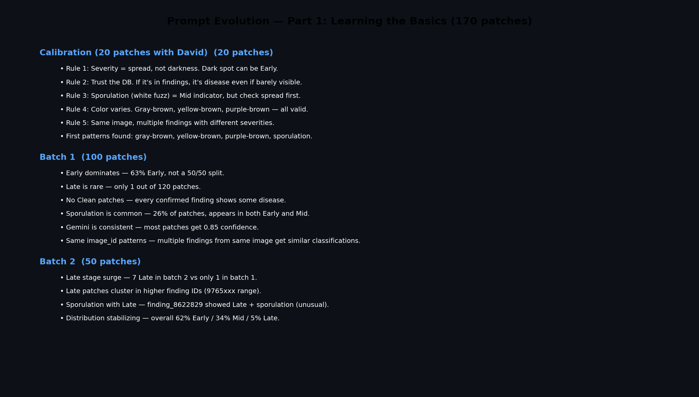
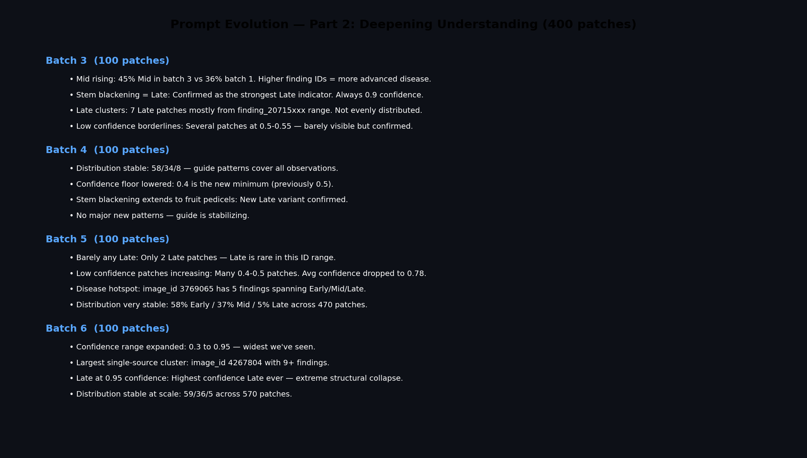
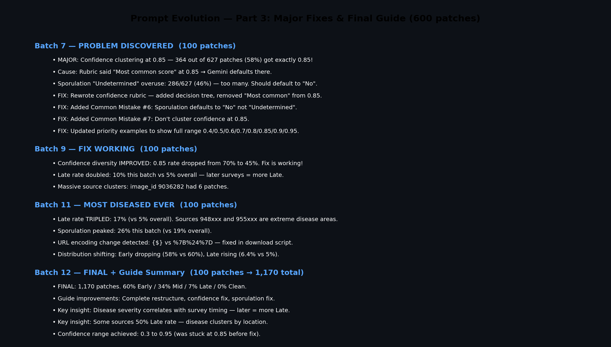

---

## Confidence Calibration — Can We Trust Gemini's Confidence?

### ECE = 0.0667

Expected Calibration Error measures: when Gemini says X% confident, is it actually right X% of the time? ECE = 0 means perfect calibration, 1 = worst.

Our ECE = 0.0667 looks good — confidence is off by only 6.7% on average. But this is misleading.

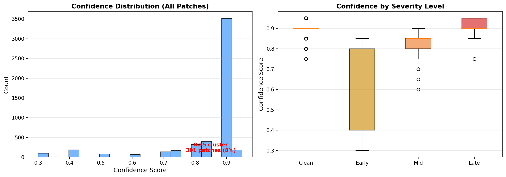

### The 0.9 Bin Dominates

3,905 patches (76% of all data) have confidence around 0.9. This one bin dominates the ECE average. Looking at individual bins reveals problems:

| Confidence Bin | Actual Accuracy | Assessment |
|---------------|----------------|------------|
| 0.9 (n=3,905) | 85% | Slightly overconfident (says 90%, right 85%) |
| 0.8 (n=483) | 55% | Very overconfident (says 80%, right 55%) |
| 0.6-0.7 (n=208) | 49-55% | Nearly a coin flip — overconfident |
| 0.3-0.5 (n=373) | 40-57% | Mixed — sometimes underconfident |

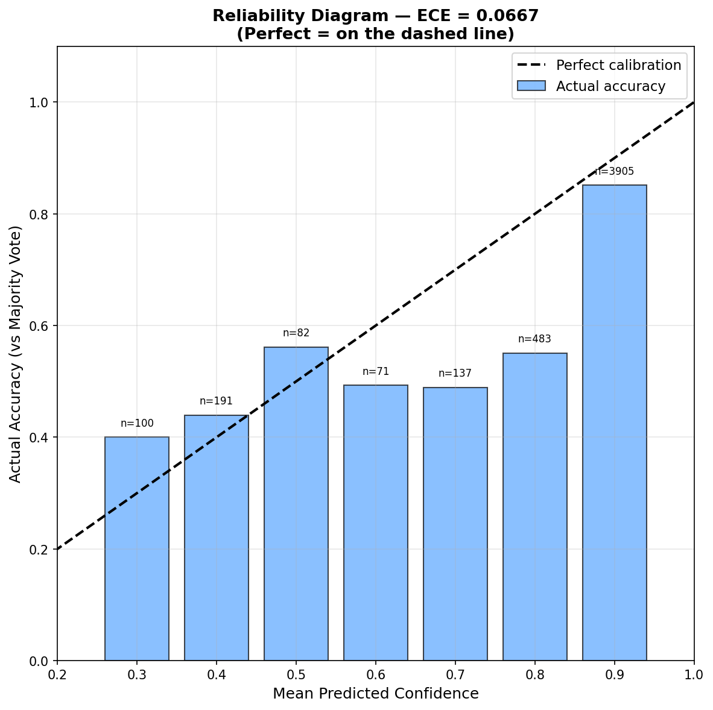

**Key insight**: Higher confidence generally means higher accuracy — the trend goes up. But there's a consistent gap: Gemini is overconfident at every level. At mid-confidence (0.6-0.8), the gap is worst — nearly a coin flip despite 70% stated confidence.

**For the article**: LLM confidence should not be trusted blindly. At high confidence (0.85+) it's reasonably reliable. At mid-confidence it's essentially meaningless. This is an important finding about LLM-based classification systems.

**Caveat**: All accuracy is measured against majority vote, which is biased. Real calibration needs expert labels.

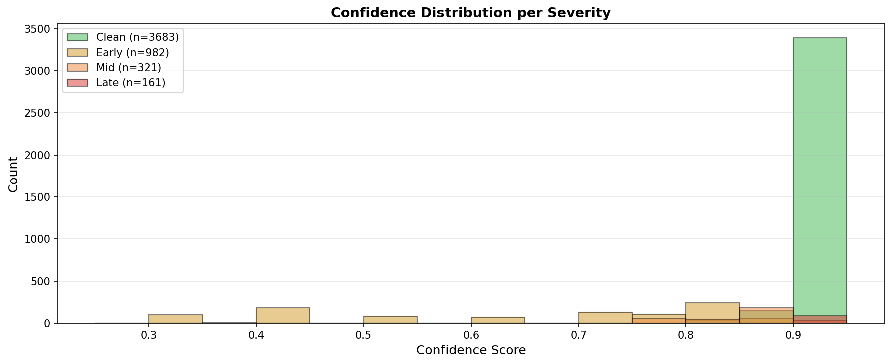

---

## Complementarity — Do Methods Cover Each Other's Blind Spots?

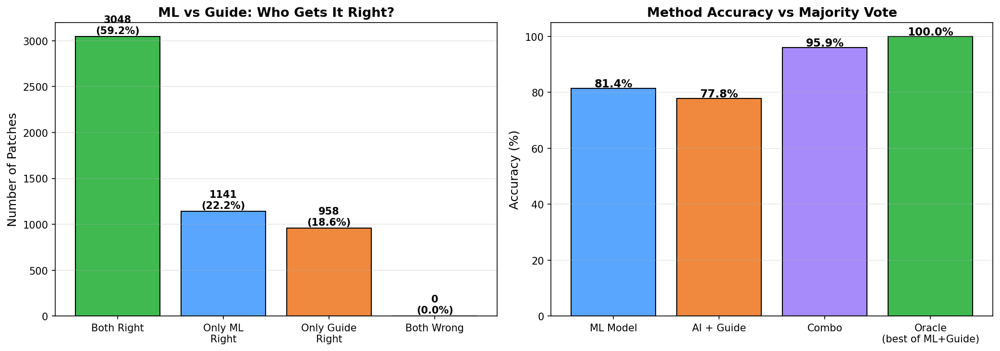

This analysis confirms: ML and Guide make DIFFERENT types of mistakes. They truly complement each other:
- ML catches everything (0 false negatives) but cries wolf often
- Guide is more precise but misses some patches
- Where ML fails (false alarms), Guide is often right
- Where Guide fails (misses), ML is often right

The "Oracle" (theoretical best: always pick whichever method is right) shows the ceiling — if we could perfectly combine them, accuracy would be higher than either method alone. The Combo method approximates this Oracle approach.

---

## Spatial Disease Patterns

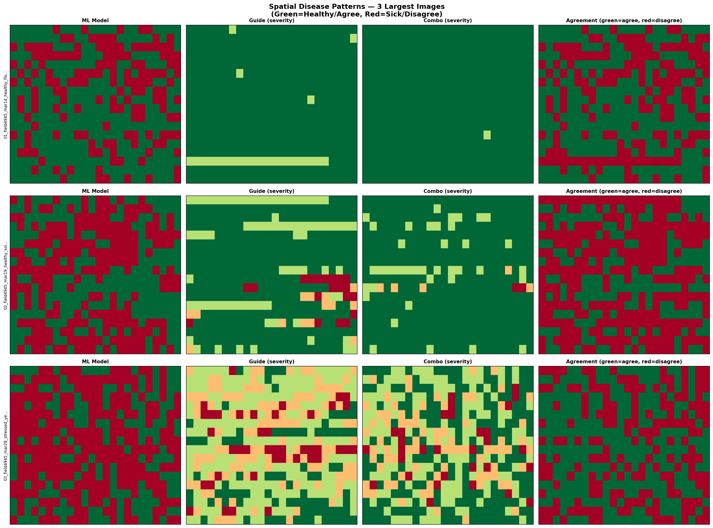

The heatmaps reveal:
- **ML** paints large areas red (Sick) — scattered, noisy detection
- **Guide** is spatially coherent — disease clusters in logical areas
- **Combo** is the cleanest — only highlights patches where both methods agree
- **Disagreement clusters** in specific image regions, often at edges or in areas with visual noise (soil, shadows)

---

## Qualitative Method Comparison

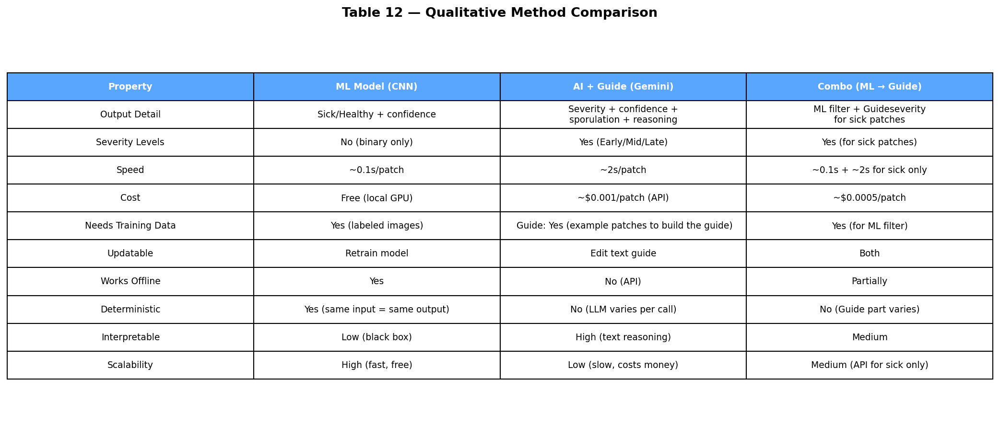

| Property | ML Model | AI + Guide | Combo |
|----------|----------|-----------|-------|
| Output | Sick/Healthy + confidence | Severity + confidence + sporulation + reasoning | ML filter + Guide severity |
| Speed | ~0.1s/patch | ~2s/patch | ~0.1s + ~2s for sick |
| Cost | Free (local) | ~$0.001/patch | ~$0.0005/patch |
| Training Data | Labeled images (sick + fake healthy) | Example patches to build guide (sick only) | Both |
| Updatable | Retrain entire model | Edit text guide | Both |
| Deterministic | Yes (same input = same output) | No (LLM varies per call, 12.2% contradiction rate) | No |
| Interpretable | Low (black box) | High (text reasoning per patch) | Medium |

---

## Summary of All Findings

### Method Rankings (vs Majority Vote — biased, see limitations)
1. **Combo** — Best overall. 95.9% accuracy, 0 FP, only 209 FN. Fewest errors (209 vs 958 vs 1,141).
2. **ML** — High recall (catches everything) but 958 false alarms. Good as a first filter.
3. **Guide** — Most detailed output but most errors in this comparison (biased by majority vote).

### Key Discoveries
1. **Combo is the best method** — statistically proven (McNemar, p ≈ 0). If the Guide is good and ML is good, the Combo will be excellent.
2. **LLM non-determinism**: 630 patches (12.2%) got opposite answers from the same model. Major reliability concern.
3. **Guide generalized from sick-only training**: Never saw healthy patches but detected them. Impressive but limited.
4. **Majority vote is biased**: ML and Combo are correlated (77% automatic agreement). Guide is unfairly disadvantaged.
5. **Confidence calibration**: ECE = 0.0667 but misleading. Mid-confidence predictions are unreliable (coin flip at 0.6-0.7).
6. **Methods complement each other**: They make different mistakes. ML catches what Guide misses and vice versa.
7. **Prompt evolution works**: The guide improved measurably through 12 batches of feedback — confidence fix, sporulation fix, severity refinement.

### Limitations of Round 1
1. **No real ground truth** — majority vote is biased (ML+Combo correlation)
2. **Training data** — ML trained on sick + fake healthy. Guide trained on sick only. Neither saw real healthy patches.
3. **LLM non-determinism** — 12.2% of patches get different answers on re-run
4. **Confidence clustering** — despite fixes, 0.85 still dominates (partially fixed from 58% to 45%)

### What Round 2 Must Fix
1. Include **real healthy patches** in training for both methods
2. Use **expert labels** as ground truth (not majority vote)
3. Build **Guide v2 from scratch** with healthy + sick patches, then merge with v1
4. **YOLO model** for proper object detection (not just classification)
5. Run Guide **multiple times** per patch to reduce non-determinism
6. Remove "trust the database" bias from the guide

---
